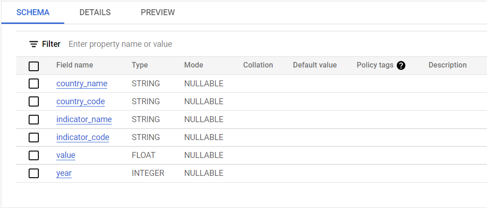

# My Final Project
This Is My final project, for the Uni 12 week Bootcamp.

## Table of contents
- [Introduction](#Introduction)
- [Finding the best dataset](#Finding-the-best-dataset)
- [Data cleaning and planning](#Data-cleaning-and-planning)
- [Data visualization](#Data-visualization)
- [Data Exploration](#Data-Exploration)
- [Review](#Review)
- [Conclusion](#Conclusion)

---
## Introduction

#### What are the project requirements?

This project has a set of requirements. I have listed them below and will review them at the end of the project to show how I have completed them:

- Use a dataset of a minimum of 1000 records.
- Provide evidence of data validity (explain the source of the data)
- Utilizing a minimum of 3 data technologies, e.g., [Plotly](https://plotly.com/python/), [GitHub](https://docs.github.com/en), [Google Docs](https://support.google.com/docs/topic/9046002?hl=en-GB&ref_topic=1382883)
- Make Pull Requests reviewed by other team members
- Use data visualization: a minimum of 5 different types of data visualization from a minimum of 2 libraries, e.g., [Plotly](https://plotly.com/python/), [Matplotlib](https://matplotlib.org/stable/index.html)
- Document the project with a Readme
- Use some statistical or machine learning analysis, e.g., Linear regression Clustering or Classification
- Comment code blocks to explain their purpose
- Present the project using [slides.com](https://slides.com/)
## Finding the best dataset		

I have decided to get my data from [BigQuery public datasets](https://cloud.google.com/bigquery/public-data?_ga=2.180085732.-1903192553.1663671110) because I wanted to test a hypothesis that I initially formulated: 

> "the quality of education positively affects the economic and social success of a country." 

I have chosen to use [Standard SQL language](https://cloud.google.com/bigquery/docs/reference/standard-sql/introduction) to obtain and filter my initial dataset as it would make my subsequent data exploration in [Pandas](https://pandas.pydata.org/docs/) faster. Moreover, BigQuery's SQL engine is powerful, which could also reduce the time I would spend exploring the initial data.
I have chosen to look at the [World Bank international education dataset](https://datacatalog.worldbank.org/search/dataset/0038480) via BigQuery. The dataset has the necessary statistics, e.g., the student population in each country, and covers all the countries in 2022 and the different school sectors, e.g., Secondary, Primary, and so on.


The schema of the first data set I have used is screenshot below:


	
## Data cleaning and planning	
#### What are some issues with my data and how do i plan to solve them?	

The first dataset, I have from Google BigQuery has a few issues due to excess fields that I do not need for my project. 
I took a screenshot from the bottom of my table and highlighted some of the fields that i do not need that also are affecting my data visulisation. For example, the field ‘Low & middle income’will affect visulisation because it will have a much higher value count then an individual country because it is a group.


I plan to fix this problem by dropping the unnecessary fields and consequently making the data easter to read and produce graphs from. In order to do this, I followed a few steps. 
Firstly I uploaded the dataset to DeepNote in order to apply data cleaning techniques, to do this i used the code 
```
cou_edu = pd.read_csv('Total_pop_edu.csv')
cou_edu
What this has done, is take the data out of the CSV file and convert it into a table within the deepnote. Making the new name name for this dataset: cou_edu
```
once i had the data uploaded i entered code to find all of the different names within the dataset, this is done using the command word Unique. In order to use this command i had to see what the column header names to tell the deepnote what column to find the unique values in. 
```
cou_edu.head(1)
```
The line of code above allows me to see all of the collum headers with only 1 data result, with this information i am able to run the unique formula to establish what country names are in this dataset
```
cou_edu['country_name'].unique()
``` 
I can then take this and see the list of all the different countries that there are values for, this will enable me to see whether the list only consists of countries and not collectives like highlighted in the image above.

#### What tables do i need to join in order to prove my hypothesis?	
## Data visualization	
#### What different charts and graphs will i be using?	
## Data Exploration
#### What does the visulised data show about my chosen topic?	
## Review	
#### Do these findings support my hypothesis?	
#### Upon completing this project, do i still support my hypothesis?	
## Conclusion
